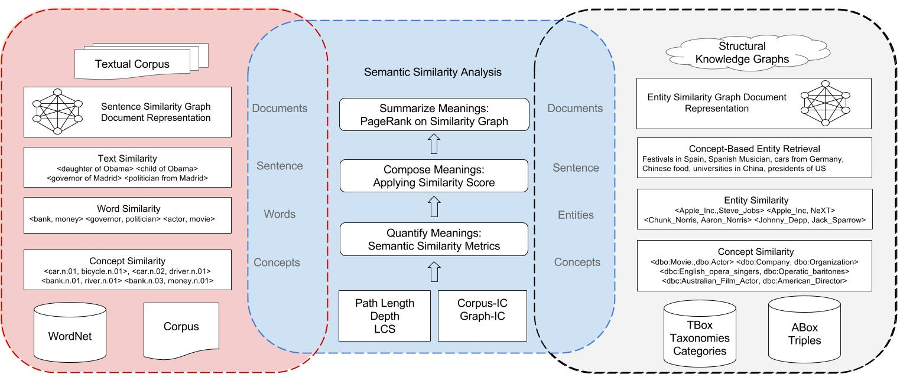

------------------

# Introduction

Sematch is an integrated framework for the development, evaluation, and application of semantic similarity for Knowledge Graphs. Semantic similarity is a very useful metric for many applications that require to quantify the semantic similarity between concepts. Sematch focuses on knowledge-based semantic similarity using structural knowledge in taxonomy (e.g. depth, path length, least common subsumer), and statistical information contents (corpus-IC and graph-IC). 



Many applications share a common pipeline in using semantic similarity analysis. In textual applications, word similarity is measured based on WordNet with various semantic similarity metrics. Then text similarity (sentence level) is measured by composing word similarities, while document level text could be analysed by identifying important sentences based on text similarity, e.g. TextRank. This process starts from measuring concept similarity (word meanings or senses which are denoted as synsets in WordNet) which is normally referred as knowledge-based semantic similarity compared to its conterpart corpus-based approaches that are based on word coocurrence (e.g. Pointwise Mutual Information) or distributional semantics (Explict Semantic Analysis, Word2Vec, GLOVE and etc). Concept similarity are normally quantified using various information such as structural knowledge (e.g. path length, depth, least common subsumer) and statistical knowledge ( information content). 

KG based applications also meet the requirments in computing concept similarity (e.g. `http://dbpedia.org/class/yago/Actor109765278`) and entity similarity (e.g. `http://dbpedia.org/resource/Madrid`). Since entities usually contain several concepts to describe entity meanings, similar to word similarity, entity similarity can be quantified based on their concept similarity. Moreover, those concepts in KGs are usually constructed into hierarchical taxonomies, such as DBpedia ontology class, Wikipedia categories, therefore quantifying concept similarity in WordNet or DBpedia relies on similar semantic information (e.g. path length,  depth, least common subsumer, information content) and semantic similarity metrics (e.g. Path, Wu & Palmer,Li,  Resnik, Lin, Jiang & Conrad and WPath). Consequently,  Sematch provides an integrated framework to develop and evaluate semantic similarity metrics for concepts, words, entities and their applications. 

------------------


## Getting started: 20 minutes to Sematch

Install Sematch

```
pip install sematch
python -m sematch.download
```

The core module of Sematch is measuring semantic similarity between concepts that are represeted as concept taxonomies. Word similarity is computed based on the maximum semantic similarity of WordNet concepts. You can use Sematch to compute multilingual word similarity based on WordNet with various of semantic similarity metrics.

```python
from sematch.semantic.similarity import WordNetSimilarity
wns = WordNetSimilarity()

# Computing English word similarity using Li method
wns.word_similarity('dog', 'cat', 'li') # 0.449327301063
# Computing Spanish word similarity using Lin method
wns.monol_word_similarity('perro', 'gato', 'spa', 'lin') #0.876800984373
# Computing Chinese word similarity using  Wu & Palmer method
wns.monol_word_similarity('狗', '猫', 'cmn', 'wup') # 0.857142857143
# Computing Spanish and English word similarity using Resnik method
wns.crossl_word_similarity('perro', 'cat', 'spa', 'eng', 'res') #7.91166650904
# Computing Spanish and Chinese word similarity using Jiang & Conrad method
wns.crossl_word_similarity('perro', '猫', 'spa', 'cmn', 'jcn') #0.31023804699
# Computing Chinese and English word similarity using WPath method
wns.crossl_word_similarity('狗', 'cat', 'cmn', 'eng', 'wpath')#0.593666388463
```

You can use sematch to compute semantic similarity between YAGO concepts with various of semantic similarity metrics.

```python
from sematch.semantic.similarity import YagoTypeSimilarity
sim = YagoTypeSimilarity()

#Measuring YAGO concept similarity through WordNet taxonomy and corpus based information content
sim.yago_similarity('http://dbpedia.org/class/yago/Dancer109989502', 
                    'http://dbpedia.org/class/yago/Actor109765278', 'wpath') #0.642
sim.yago_similarity('http://dbpedia.org/class/yago/Dancer109989502',
                    'http://dbpedia.org/class/yago/Singer110599806', 'wpath') #0.544

#Measuring YAGO concept similarity based on graph-based IC sim.yago_similarity('http://dbpedia.org/class/yago/Dancer109989502', 
                    'http://dbpedia.org/class/yago/Actor109765278', 'wpath_graph') #0.423
sim.yago_similarity('http://dbpedia.org/class/yago/Dancer109989502',
                    'http://dbpedia.org/class/yago/Singer110599806', 'wpath_graph') #0.328
```

You can use sematch to compute semantic similarity between DBpedia concepts with different similarity metrics.

```python
from sematch.semantic.graph import DBpediaDataTransform, Taxonomy
from sematch.semantic.similarity import ConceptSimilarity
concept = ConceptSimilarity(Taxonomy(DBpediaDataTransform()), 'models/dbpedia_type_ic.txt')
concept.name2concept('actor')
concept.similarity('http://dbpedia.org/ontology/Actor', 'http://dbpedia.org/ontology/Film', 'path')
concept.similarity('http://dbpedia.org/ontology/Actor', 'http://dbpedia.org/ontology/Film', 'wup')
concept.similarity('http://dbpedia.org/ontology/Actor', 'http://dbpedia.org/ontology/Film', 'li')
concept.similarity('http://dbpedia.org/ontology/Actor', 'http://dbpedia.org/ontology/Film', 'res')
concept.similarity('http://dbpedia.org/ontology/Actor', 'http://dbpedia.org/ontology/Film', 'lin')
concept.similarity('http://dbpedia.org/ontology/Actor', 'http://dbpedia.org/ontology/Film', 'jcn')
concept.similarity('http://dbpedia.org/ontology/Actor', 'http://dbpedia.org/ontology/Film', 'wpath')
```

You can also compute entity similarity.

```python
from sematch.semantic.similarity import EntitySimilarity
sim = EntitySimilarity()
sim.similarity('http://dbpedia.org/resource/Madrid','http://dbpedia.org/resource/Barcelona') #0.409923677282
sim.similarity('http://dbpedia.org/resource/Apple_Inc.','http://dbpedia.org/resource/Steve_Jobs')#0.0904545454545

sim.relatedness('http://dbpedia.org/resource/Madrid','http://dbpedia.org/resource/Barcelona')#0.457984139871
sim.relatedness('http://dbpedia.org/resource/Apple_Inc.','http://dbpedia.org/resource/Steve_Jobs')#0.465991132787
```

It is easy to evaluate a similarity metric with common word similarity datasets, including cross-lingual and multilingual word similarity datasets.

```python
from sematch.evaluation import WordSimEvaluation
from sematch.semantic.similarity import WordNetSimilarity
evaluation = WordSimEvaluation()
evaluation.dataset_names()
wns = WordNetSimilarity()
# define similarity metrics
wpath = lambda x, y: wns.word_similarity_wpath(x, y, 0.8)
# evaluate similarity metrics
evaluation.evaluate_metric('wpath', wpath, 'noun_simlex')
# performa Steiger's Z significance Test
evaluation.statistical_test('wpath', 'path', 'noun_simlex')
# define similarity metrics for Spanish words
wpath_es = lambda x, y: wns.monol_word_similarity(x, y, 'spa', 'path')
# define cross-lingual similarity metrics for English-Spanish
wpath_en_es = lambda x, y: wns.crossl_word_similarity(x, y, 'eng', 'spa', 'wpath')
# evaluate metrics
evaluation.evaluate_metric('wpath_es', wpath_es, 'rg65_spanish')
evaluation.evaluate_metric('wpath_en_es', wpath_en_es, 'rg65_EN-ES')
```

Although the word similarity correlation measure is the standard way to evaluate the semantic similarity metrics, it relies on human judgements over word pairs which may not have same performance in real applications. Therefore, apart from word similarity evaluation, the Sematch evaluation framework also includes a simple aspect category classification.

```python
from sematch.evaluation import AspectEvaluation
from sematch.application import SimClassifier, SimSVMClassifier
from sematch.semantic.similarity import WordNetSimilarity

# create aspect classification evaluation
evaluation = AspectEvaluation()
# load the dataset
X, y = evaluation.load_dataset()
# define word similarity function
wns = WordNetSimilarity()
word_sim = lambda x, y: wns.word_similarity(x, y)
# Train and evaluate metrics with unsupervised classification model
simclassifier = SimClassifier.train(zip(X,y), word_sim)
evaluation.evaluate(X,y, simclassifier)

macro averge:  (0.65319812882333839, 0.7101245049198579, 0.66317566364913016, None)
micro average:  (0.79210167952791644, 0.79210167952791644, 0.79210167952791644, None)
weighted average:  (0.80842645056024054, 0.79210167952791644, 0.79639496616636352, None)
accuracy:  0.792101679528
             precision    recall  f1-score   support

    SERVICE       0.50      0.43      0.46       519
 RESTAURANT       0.81      0.66      0.73       228
       FOOD       0.95      0.87      0.91      2256
   LOCATION       0.26      0.67      0.37        54
   AMBIENCE       0.60      0.70      0.65       597
     DRINKS       0.81      0.93      0.87       752

avg / total       0.81      0.79      0.80      4406
```

You can use Sematch to download a list of entities having a specific type using different languages. Sematch will generate SPARQL queries and execute them in [DBpedia Sparql Endpoint](http://dbpedia.org/sparql).

```python
from sematch.application import Matcher
matcher = Matcher()
# matching scientist entities from DBpedia
matcher.match_type('scientist')
matcher.match_type('científico', 'spa')
matcher.match_type('科学家', 'cmn')
matcher.match_entity_type('movies with Tom Cruise')
```

Example of automatically generated SPARQL query.

```sql
SELECT DISTINCT ?s, ?label, ?abstract WHERE {
    {  
    ?s <http://www.w3.org/1999/02/22-rdf-syntax-ns#type> <http://dbpedia.org/class/yago/NuclearPhysicist110364643> . }
 UNION {  
    ?s <http://www.w3.org/1999/02/22-rdf-syntax-ns#type> <http://dbpedia.org/class/yago/Econometrician110043491> . }
 UNION {  
    ?s <http://www.w3.org/1999/02/22-rdf-syntax-ns#type> <http://dbpedia.org/class/yago/Sociologist110620758> . }
 UNION {  
    ?s <http://www.w3.org/1999/02/22-rdf-syntax-ns#type> <http://dbpedia.org/class/yago/Archeologist109804806> . }
 UNION {  
    ?s <http://www.w3.org/1999/02/22-rdf-syntax-ns#type> <http://dbpedia.org/class/yago/Neurolinguist110354053> . } 
    ?s <http://www.w3.org/1999/02/22-rdf-syntax-ns#type> <http://www.w3.org/2002/07/owl#Thing> . 
    ?s <http://www.w3.org/2000/01/rdf-schema#label> ?label . 
    FILTER( lang(?label) = "en") . 
    ?s <http://dbpedia.org/ontology/abstract> ?abstract . 
    FILTER( lang(?abstract) = "en") .
} LIMIT 5000
```


Apart from semantic matching of entities from DBpedia, you can also use Sematch to extract features of entities and apply semantic similarity analysis using graph-based ranking algorithms. Given a list of objects (concepts, words, entities), Sematch compute their pairwise semantic similarity and generate similarity graph where nodes denote objects and edges denote similarity scores. An example of using similarity graph for extracting important words from an entity description.

```python
from sematch.semantic.graph import SimGraph
from sematch.semantic.similarity import WordNetSimilarity
from sematch.nlp import Extraction, word_process
from sematch.semantic.sparql import EntityFeatures
from collections import Counter
tom = EntityFeatures().features('http://dbpedia.org/resource/Tom_Cruise')
words = Extraction().extract_nouns(tom['abstract'])
words = word_process(words)
wns = WordNetSimilarity()
word_graph = SimGraph(words, wns.word_similarity)
word_scores = word_graph.page_rank()
words, scores =zip(*Counter(word_scores).most_common(10))
print words
(u'picture', u'action', u'number', u'film', u'post', u'sport', 
u'program', u'men', u'performance', u'motion')
```


------------------

## Publications

- Zhu, Ganggao, and Carlos A. Iglesias. ["Computing Semantic Similarity of Concepts in Knowledge Graphs."](http://ieeexplore.ieee.org/document/7572993/) IEEE Transactions on Knowledge and Data Engineering 29.1 (2017): 72-85.

- Oscar Araque, Ganggao Zhu, Manuel Garcia-Amado and Carlos A. Iglesias [Mining the Opinionated Web: Classification and Detection of Aspect Contexts for Aspect Based Sentiment Analysis](http://sentic.net/sentire2016araque.pdf),  ICDM sentire, 2016.

- Zhu, Ganggao, and Carlos Angel Iglesias. "Sematch: Semantic Entity Search from Knowledge Graph." SumPre-HSWI@ ESWC. 2015.


------------------

## Support

You can post bug reports and feature requests in [Github issues](https://github.com/gsi-upm/sematch/issues).
Make sure to read our guidelines first.
This project is still under active development approaching to its goals. The project is mainly maintained by Ganggao Zhu. You can contact him via gzhu [at] dit.upm.es

------------------

## Why this name, Sematch and Logo?

The name of Sematch is composed based on Spanish "se" and English "match". It is also the abbreviation of semantic matching because semantic similarity metrics helps to determine semantic distance of concepts, words, entities, instead of exact matching.

The logo of Sematch is based on Chinese [Yin and Yang](http://en.wikipedia.org/wiki/Yin_and_yang) which is written in [I Ching](http://en.wikipedia.org/wiki/I_Ching). Somehow, it correlates to 0 and 1 in computer science.


